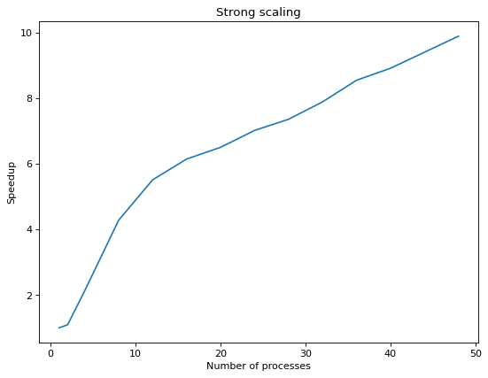
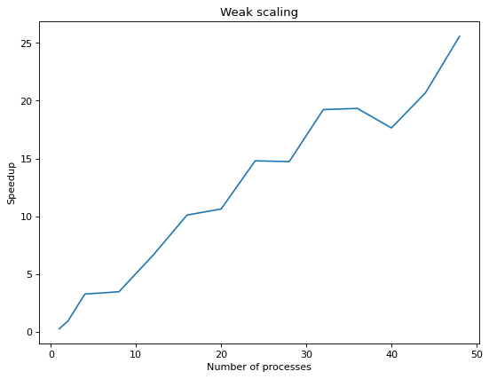

## Source files

I provide source code in `src` directory. For the sake of consistency, and in order to comply with the requirements, I added symlinks to `data_source.{h,cpp}` files in `src` directory.

The files in that directory are:

* `main.cpp` -- the file containing the `main` function. It just initializes MPI, and calls the main function -- `sa` (short version of *Suffix Array*).
* `sa.hpp` -- common interface for all the versions of suffix array computation.
* `sa.cpp` -- the most important file. It contains the whole actual (currently used) implementation of distributed suffix array computation.
* `sa_seq.cpp` -- simple, sequential version of the algorithm from the provided paper.
* `sa_v2.cpp` -- file containing (unfinished), improved implementation of the algorithm. It contains improved, and generalized functions from `sa.cpp`.
* `data_source.{h,cpp}` -- symbolic links to the provided implementation of `DataSource` class.

## Algorithm

I implement the algorithm for creating the suffix array from the provided paper. As the sorting algorithm, I use my own implementation of [*sample sort*](https://en.wikipedia.org/wiki/Samplesort), as suggested in the provided paper. This implementation is contained in function in `my_sort_params` (in `src/sa.cpp` file), and is generalized in `sa_word_size_param` (and `my_partial_sorts_param`) (in `src/sa_v2.cpp` file).

As suggested, in order to compute the number of occurrences of some given query, I use binary search in order to find positions of the first and the last occurrence of words containing the query in the suffix array (or more precisely, positions of the first occurrence of a word that is not smaller than the query and the first occurrence of a word that is greater than the query). Then the difference of this values determines the number of occurrences of the query in considered string.

## Implementation, optimizations and utilized MPI mechanisms

In my implementation I utilize a variety of MPI provided mechanisms which I will briefly describe here.

### Most obvious improvements

As the communication patterns of my programme sometimes match those of scatter and gather operations, I use the MPI provided implementation of these operations, in order to get a possible, performance improvements, as well as to increase simplicity and readability of my code.

### All-to-all communication

In various occasions, I utilize all-to-all communication, as well as its more advanced version -- `MPI_Alltoallv` (while I am awere of existence of `MPI_Alltoallw`, I did not need it as I transferred messages of the same type). This makes the communication significantly simpler, as well as provides an opportunity for transparent usage of low-lever MPI-build-in optimizations. For analogical reasons, I use mechanisms as all gather, and all reduce.

### Asynchronous mechanisms

Mover over, quite often, I use the asynchronous mechanisms (and I delay waiting for the reception of a message until strictly necessary) both in order to cover the communication with computations and in order to simplify the communication and avoid deadlocks. Some asynchronous mechanisms that I use include `MPI_I{send,recv,allgather,exscan}`.

### Advanced communication patterns

As noted in the provided paper, and as is obvious from my implementation, commonly used, more complex communication patters, such as scan (or exclusive scan) or reduce, can be used in order to provide higher level of abstraction for some parts of the code. Because of this, I use `MPI_Scan` and `MPI_Reduce`, as well as their variations (for example `MPI_Exscan`).

### Custom MPI data types

As in various occasions I need to transfer messages of non-standard sizes, I created custom MPI data types such as `my_MPI_UINT64_{Triplet,Pair}` in order to represent these message types. While I am aware that one might use just the build-in MPI types (and that `MPI_Byte` is sufficient for all communication) (by adjusting the messages sizes and offsets accordingly), I consider using types corresponding to the logical communication, a more elegant way of solving this problem.

### Custom MPI communicators

While it is not a part of the main version of the programme, I used custom MPI communicators for implementing sorting of a part of a distributed array (see `my_sort_params_partial` in `src/sa_v2.cpp`).

## Sorting algorithm

One of the crucial components of the implemented algorithm is the sorting algorithm. As the authors of provided paper suggests, I have decided to implement [*sample sort*](https://en.wikipedia.org/wiki/Samplesort), in which I randomly partition the whole array into as many parts, as we have the nodes taking part in the computation (by choosing random pivot elements from each but one node), and then, on each node, I sort the elements there using standard, sequential quick-sort, and finally I redistribute the data back to the relevant nodes.

### Customized sorting algorithm

I also modified the above algorithm in order to adjust it to sorting just some chosen subarray of the whole distributed array.

## Using `k`-mers as the base

Again as suggested in the provided paper, instead of executing the algorithm starting from single characters, we might start representing $k$ consecutive letters as individual character that fit into the type that we use to represent groups. I use `uint64_t` as the base type for my algorithm, and I choose value of the hyperparameter `k` accordingly.

## Testing

For generating small (of genome size no greater than `10000000`), random tests, I used script `gen_tests.py`, which generates given number tests with given numer of genomes (of given lengths), and queries (of given length). For testing I used a modified version of the given `run_tests.py` script. An example of a possible usage looks as follows.

* Generate the tests:

    `python3 ./gen_tests.py --genomes 10000 10000 10000 10000 --q-num 100 --q-len 10 --ensure-query-positive --num-tests 100 -o tests/my_tests_rand_10000/ --name test`

* Run the tests agains the programme:

    `./run_test.py -n 4 -m 100 --name tests/my_tests_rand_10000/test --n-tests 100`

## Performance and scaling

On the specified configuration (4 nodes, 24 threads per node), the test from `/lustre/tetyda/home/adinar/public_html/perf_test`, with `4` genomes and `80` queries takes noticeably less than the specified 5 minutes.

### Strong and weak scaling

Here I present graphs representing strong and weak scaling speedup with various numbers of processes. The graphs were generated using `get_strong_scaling.py` and `get_weak_scaling.py` scripts. For generating strong scaling results I used a single genome with `167841102` characters, and for weak scaling, a single genome with `31470206 * n` characters, where `n` is the number of processes.

